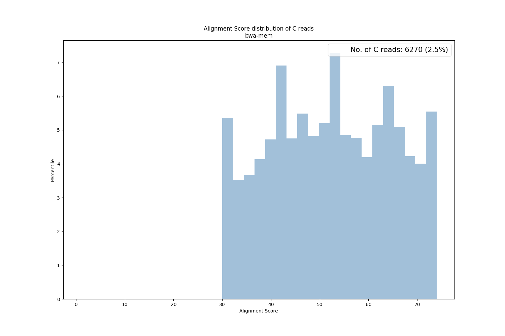

# Alignment Score

 

## Summary

The alignment score is generated by BWA-MEM as a field in SAM file. The score is determined by the formula below,

	Alignment Score = #M * [1] - #NM * [2] - ([3] + gap length * [4]) - #Clip * [5]

where #M, #NM, and #Clip stands for number of match, mismatch, and clip respectively. The arguments in the middle bracket serve as score/penalty or weight which can be specified by users.

For BWA-backtrack, no alignment score is recorded for each alignment.

SQUAT will plot the distribution of alignment score for P, S, and C reads separately in the report.

