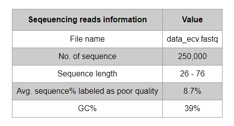
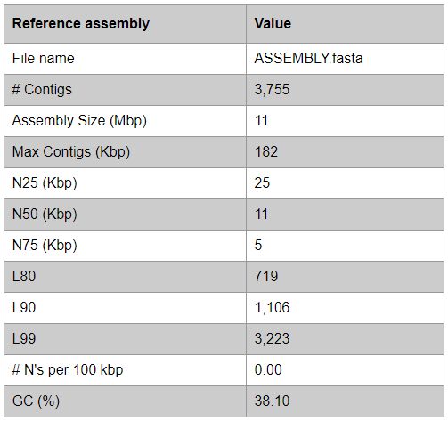
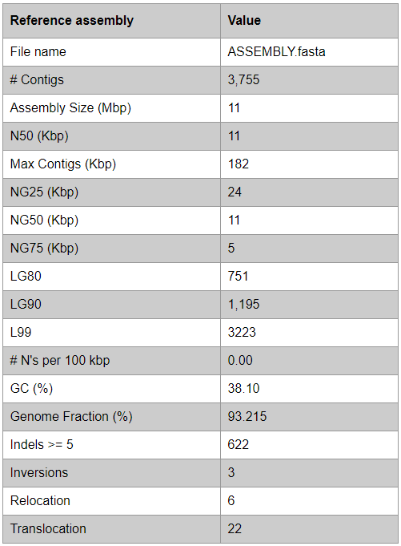

# Basic Statistics
--- 

## Summary
The module collects basic information for the sequencing reads and evaluate the reference assemblies using [QUAST](http://quast.bioinf.spbau.ru/), a genome assembly evaluation tool.

 

### Sequencing reads 

 

### Assembly evaluation

QUAST command:

	python3 SQUAT/quast/quast.py <assembly> -o <output_dir> --min-contig 200 -t <num_threads> -s

 

### Assembly evaluation (GAGE mode)
Note that if GAGE mode is activated in QUAST, statistics such as NX and LX will be replaced by NGX and LGX in the table.

QUAST command:

	python3 SQUAT/quast/quast.py <assembly> -o <output_dir> --min-contig 200 -t <num_threads> -s -R <reference genome> --gage

