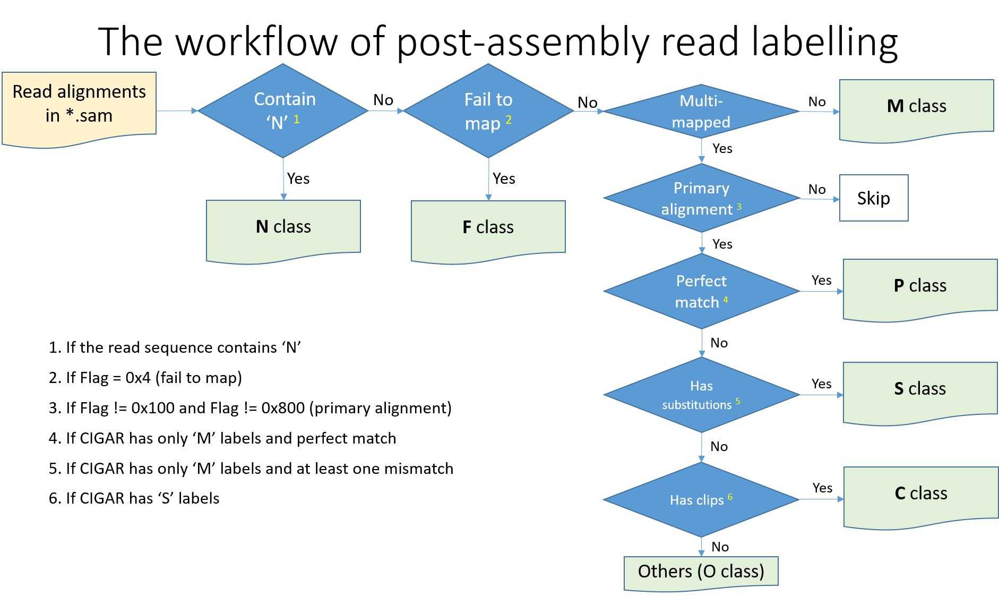
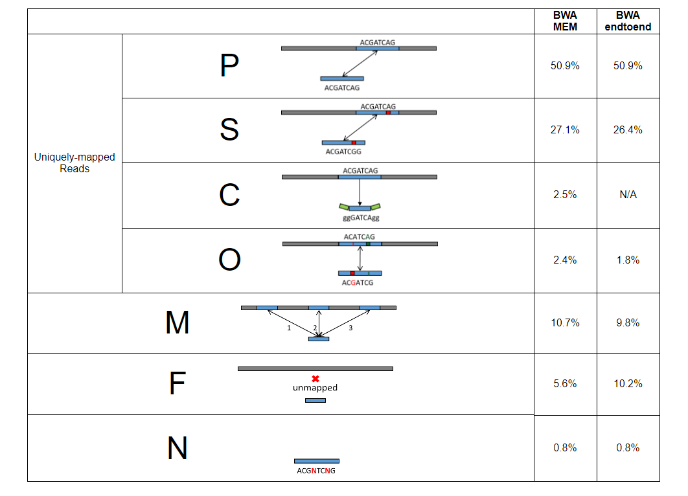
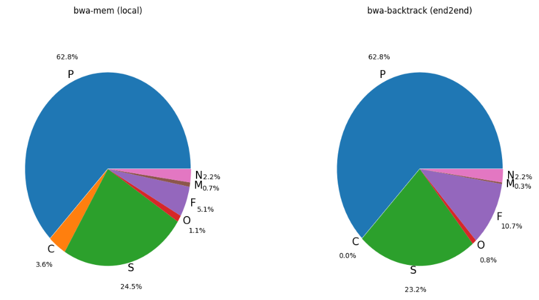
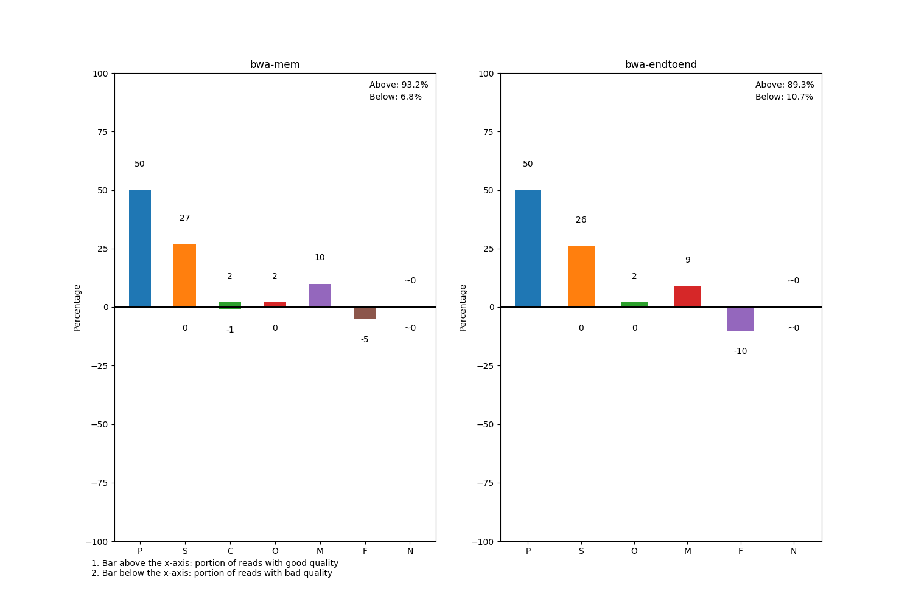

# Read Labeling

 

## Summary

In this section, we go through each step of read label tagging. Based on the discoveries from BWA mapping, we classify sequencing reads into seven categories. 

 

## BWA Mapping

SQUAT maps sequencing reads against their assemblies using two different algorithms: **BWA-MEM and BWA-backtrack**. The former algorithm performs local alignment with multiple alignments for different part of a query sequence, while the latter is more suitable for short reads and tries to map the whole sequence. For more explanation, see the [manual of BWA](http://bio-bwa.sourceforge.net/bwa.shtml).

 

## Reading Labeling Workflow

The basic workflow looks as following,

First, we label the sequences containing N to the N class. Next, based on the Flag and MAP fields in SAM file, reads indicated as unmapped and multi-mapped are assigned to F and M class respectively. The rest of reads are uniquely-mapped. They an be further divided into P(Perfect), S(substitution errors), C(contain clips), and O(other errors) class according to the CIGAR field of their primary alignment.

| Label | Description |
|:-:|:-:|
| P | Perfectly-matched reads |
| S | Reads with substitution errors |
| C | Reads that contain clips |
| O | Reads with other errors|
| M | Multi-mapped reads |
| F | Unmapped reads |
| N | Reads that contain N |

For detailed specification of SAM file, see [SAM Spec](http://samtools.github.io/hts-specs/SAMv1.pdf).

 

## Label Distribution

### Table

For each strategy SQUAT adopts for alignment, it lists the label distribution with an icon to represent each read class in a table.

 

### Piechart
In addition, we use a piechart to get a better sense about the label composition of data.

 

### Barchart

Lastly, we plot a barchart to display the **percentage of poorly-mapped reads** for each read class. Reads in P and M class are always considered high quality while unmapped (F) reads will always be of poor quality. For reads in S, C, O and N class, we specify certain thresholds to determine the sequencing quality of each read. For threshold definition, see [mismatch, clip and N ratio](ratio.md)

